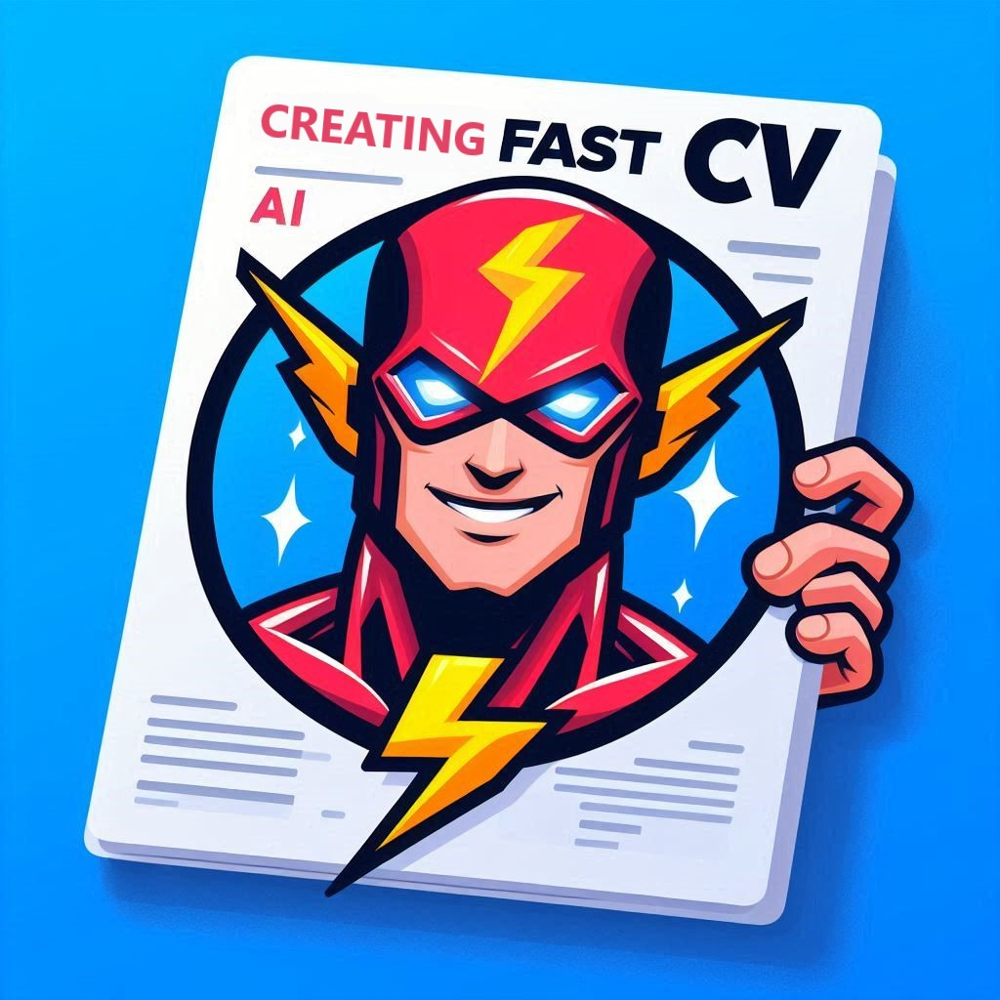

# FastCV-IA
 Aplicacion Web para la creacion de **CV** de manera profesional, rápida y dinámica con el uso de la IA Gemini.
 
FastCV-IA permite a los usuarios ingresar información detallada sobre sí mismos para generar un curriculum vitae adaptado a una oferta de trabajo específica, todo con la ayuda de la inteligencia artificial.

Este PDF generado es el **Template** de Harvard y sus normativas [Link al recurso](https://careerservices.fas.harvard.edu/resources/harvard-college-guide-to-resumes-cover-letters/)

<p align="center"></p>

## Caracteristicas y Uso

Contiene un Formulario que guarda los datos del usuario para su uso posterior en el **CV** que será analizado junto a la IA.

Genera un CV en formato **PDF** con IA.
Para optimizar la compatibilidad con empleos, mejoras y ayudas para un mejor *curriculum vitae*, mayor compatibilidad junto a que podrias mejorar para ser más óptimo para el puesto.

Este PDF generado es el **Template** de Harvard y sus normativas [Link al recurso](https://careerservices.fas.harvard.edu/resources/harvard-college-guide-to-resumes-cover-letters/) 

### Funcionalidades

#### CV sin descripcion del empleo
- Genera un feedback de que añadir a los datos proporcionados
#### CV con descripcion del empleo
 - Genera un porcentaje del 0% al 100% con la compatibilidad del empleo

 - Genera un mensaje de feedback sobre que mejorar en el empleo.


## API /api/createcv
Api que usa la inteligencia artificial geminis para resumir y adaptar tu cv a una propuesta de trabajo.

### Campos Req

> Solo los campos que dicen opcional son opcionales!

*Algunos objetos son opcionales*
``` json
{
  "user": {
    "personalInfo": {
      "name": "string",
      "lastName": "string",
      "email": "string",
      "phone": "string",
      "description": "string" 
    },
    "technicalSkills": [
        {
          "name": "string"
        }
      ], // **opcional**
    "education": [
      {
        "name": "string",
        "location": "string",
        "degree":"string",
        "concentration": "string",
        "graduationDate": "string", 
        "gpa": "string", // **opcional**
        "thesis": "string", // **opcional**
        "relevantEvents":"string", // **opcional**
        "courseWorks":"string" // **opcional**
      }],
    "experience":  [
        {
          "organization": "string",
          "location": "string",
          "position": "string",
          "startDate": "string",
          "endDate": "string",
          "description": "string"
        }
      ], // **opcional**
    "projects":  [
        {
          "name": "string", 
          "position": "string",
          "description": "string"
        }
      ], // **opcional**
    "leadershipAndActivities": [
        {
          "organization": "string",
          "role": "string",
          "location": "string",
          "startDate": "string",
          "endDate": "string",
          "achievements": "string"
        }
      ], // **opcional**
    "jobDescription": "string" // **opcional**
  }
}

```

### Object Res

Respuesta del modelado del objeto a la hora de usar la API

#### Notas
Tiene un máximo de datos de respuesta esto para no hacer el cv muy largo, esto se adaptara a los objetos con mayor compatibilidad con la descripcion del empleo

- education: un máximo de 3 objetos
- experience: un máximo de 3 objetos
- projects: un máximo de 2 objetos
- leadershipAndActivities: un máximo de 2 objetos

También las descripciones tienen un máximo de caracteres: 
- Descripción *personal* devolvera máximo 300 caracteres
- Experiencia description del empleo devolvera máximo 350 caracteres
- Proyectos description del proyecto devolvera máximo 350 caracteres
- Leadership description del empleo devolvera máximo 350 caracteres

Detalles relevantes: 
- todos los formatos de fechas se colocan como mes y año 
- toda la informacion no proporcionada se colocas como "undefined".

#### **Modelo de objeto**
``` json
{
  "cv": {
    "personalInfo": {
      "name": "string",
      "lastName": "string" ,
      "email": "string",
      "phone": "number"
    },
    "education": [
      {
        "name": "string",
        "location": "string",
        "degree": "string",
        "concentration": "string",
        "gpa": "string",
        "graduationDate": "string",
        "thesis": "string",
        "relevantEvents": "string",
        "courseWorks": "string",
        "type": "string"
      }
    ],
    "experience": [
      {
        "organization": "string",
        "location": "string",
        "position": "string",
        "startDate": "string",
        "endDate": "string",
        "description": "string"
      }
    ],
    "projects": [
      {
        "name": "string",
        "position": "string",
        "description": "string"
      }
    ],
    "leadershipAndActivities": [
      {
        "organization": "string",
        "location": "string",
        "role": "string",
        "startDate": "string",
        "endDate": "string",
        "achievements": ["string"]
      }
    ],
    "technicalSkills": [
      {
        "category": "string",
        "skills": ["string"]
      }
    ],
    "compatibilityWithWork": "number",
    "feedbackMessage": "string"
  }
}

```

## Instalación y Contribución
Puedes contribuir con tu propio **Template** de CV 📌

1. Clona el Repositorio
2. Instala las librerias 
3. Utiliza tu propia API KEY de gemini en tus variables de entorno, ejemplo: NEXT_PUBLIC_GEMINIS_API_KEY=yourApiKey
4. Crea tu propio template de CV
5. Contribuye con tu propio template de CV a través de una Pull Request

## Como Crear un Template de CV
! Para crear un template de CV, sigue estos pasos:

1. Crea un nuevo componente en la ruta components/cv/components/*TemplateNamecomponent.js*
2. El componente tiene que recibir una propiedad llamada User *seran los datos que llegan al usuario*
3. Importa la funcion **createPDF** *esto sera el boton de descargar*
4. Crea un div con todo el contenido del **template** 
5. Al div creale una referencia *ref* que se lo vas a colocar como parametro a la funcion **createPDF**
6. Crea el boton para descargar el pdf fuera del div de referencia 

Despues de esto puedes añadir el nuevo **Template** como componente en el index, de la misma manera en que se utiliza ***TemplateHarvard***

## Contacto

Cualquier información de algún error o posible sugerencia, no dudes en contactarme 

Correo: billalbertcode@gmail.com

Otras Redes:

Porfolio: https://bill.caribito.com/bill/

Linkedin: https://www.linkedin.com/in/billalbertcode

Intagram: https://www.instagram.com/billalbertcode/

X: https://twitter.com/BillalbertCode
